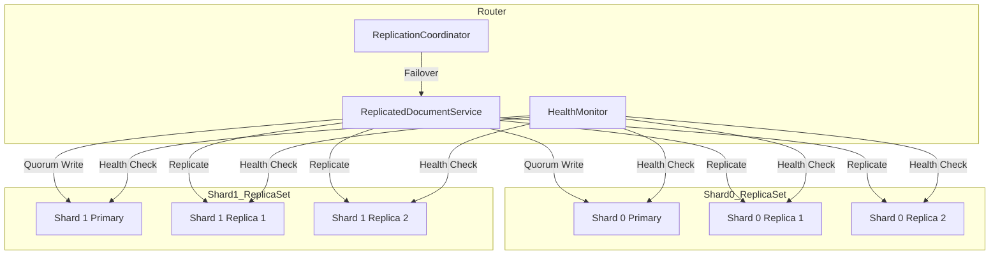
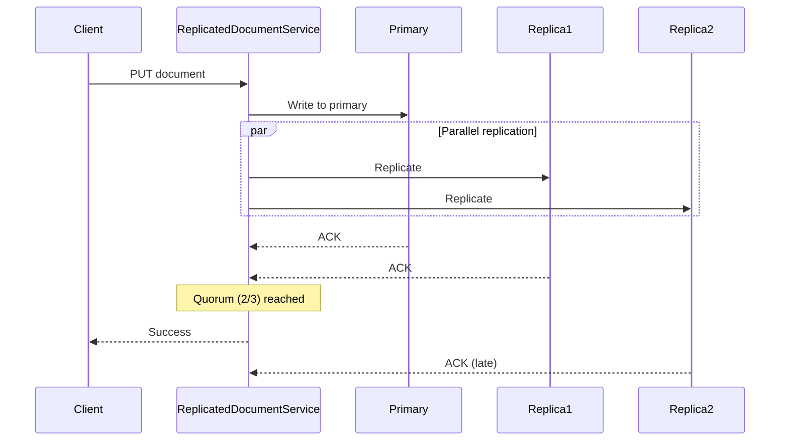
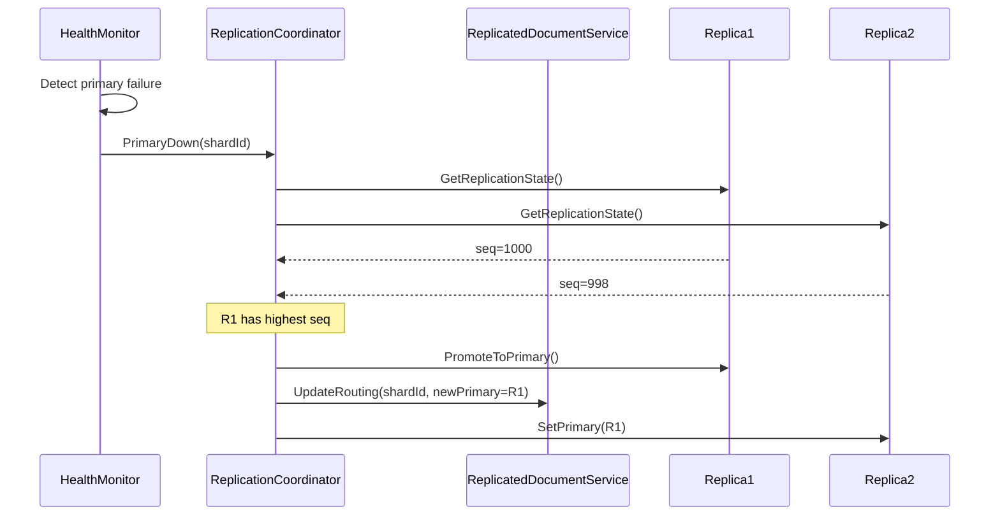

# Replication Implementation for PeaceDatabase

## Architecture Overview



## Key Components

### 1. Configuration Layer

**[`Storage/Sharding/Replication/Configuration/ReplicationOptions.cs`](Storage/Sharding/Replication/Configuration/ReplicationOptions.cs)**

```csharp
public sealed class ReplicationOptions
{
    public bool Enabled { get; set; } = false;
    public int ReplicaCount { get; set; } = 2;      // Replicas per shard
    public int WriteQuorum { get; set; } = 2;       // Acks needed for write
    public int ReadQuorum { get; set; } = 1;        // Nodes to read from
    public int FailoverTimeoutMs { get; set; } = 5000;
    public int HealthCheckIntervalMs { get; set; } = 3000;
    public int MaxReplicationLagMs { get; set; } = 10000;
}
```

### 2. Replica Set Management

**ReplicaSet** - Represents a shard with its primary and replicas:

- Tracks primary node and all replicas
- Handles quorum writes (fan-out to replicas, wait for majority)
- Manages failover and leader election
- Monitors replication lag

**ReplicaInfo** - Extends existing `ShardInfo`:

- `IsPrimary` - Whether this node is the current primary
- `ReplicaIndex` - Position within replica set (0 = primary candidate)
- `SyncState` - InSync, Lagging, Offline
- `LastSeq` - Last known sequence number for lag calculation

### 3. Write Path (Quorum)



### 4. Failover Flow



## File Structure

```
Storage/Sharding/Replication/
├── Configuration/
│   ├── ReplicationOptions.cs       # Replication settings
│   └── ReplicaEndpoint.cs          # Replica connection info
├── ReplicaInfo.cs                  # Extended shard info with replica state
├── ReplicaSet.cs                   # Manages shard's replicas
├── Client/
│   ├── IReplicaClient.cs           # Extends IShardClient with replication
│   ├── HttpReplicaClient.cs        # HTTP client with replication support
│   └── LocalReplicaClient.cs       # In-process replica client
├── ReplicationCoordinator.cs       # Orchestrates replica sets
├── HealthMonitor.cs                # Background health checking
├── LeaderElection.cs               # Primary election logic
├── ReplicatedDocumentService.cs    # IDocumentService with replication
└── ReplicationServiceBuilder.cs    # DI registration
```

## Integration Points

### Extending Existing Code

1. **[`ShardingOptions.cs`](PeaceDatabase/Storage/Sharding/Configuration/ShardingOptions.cs)** - Add `ReplicationOptions Replication` property

2. **[`ShardInfo.cs`](PeaceDatabase/Storage/Sharding/Configuration/ShardInfo.cs)** - Add replica-related fields or create `ReplicaInfo` that inherits from it

3. **[`IShardClient.cs`](PeaceDatabase/Storage/Sharding/Client/IShardClient.cs)** - Add replication methods:

   - `GetReplicationStateAsync()` - Returns current seq, WAL position
   - `ReplicateAsync(Document)` - Replicate a write operation

4. **[`HttpShardClient.cs`](PeaceDatabase/Storage/Sharding/Client/HttpShardClient.cs)** - Implement new replication methods

### New API Endpoints (on shards)

```
GET  /v1/_replication/state         # Get replication state (seq, lag)
POST /v1/_replication/replicate     # Receive replicated write
POST /v1/_replication/promote       # Promote to primary
GET  /v1/_replication/wal           # Stream WAL for catch-up
```

## Configuration Example

**appsettings.Replication.json**:

```json
{
  "Sharding": {
    "Enabled": true,
    "Mode": "Distributed",
    "ShardCount": 3,
    "Replication": {
      "Enabled": true,
      "ReplicaCount": 2,
      "WriteQuorum": 2,
      "ReadQuorum": 1,
      "FailoverTimeoutMs": 5000,
      "HealthCheckIntervalMs": 3000
    },
    "Shards": [
      { "Id": 0, "Primary": "http://shard-0-primary:8080", "Replicas": ["http://shard-0-replica-1:8080", "http://shard-0-replica-2:8080"] },
      { "Id": 1, "Primary": "http://shard-1-primary:8080", "Replicas": ["http://shard-1-replica-1:8080", "http://shard-1-replica-2:8080"] },
      { "Id": 2, "Primary": "http://shard-2-primary:8080", "Replicas": ["http://shard-2-replica-1:8080", "http://shard-2-replica-2:8080"] }
    ]
  }
}
```

## Docker Compose for Replicated Shards

**docker-compose.replication.yml** will define:

- 1 router service
- 3 shards x 3 nodes each = 9 data services
- Each replica set forms its own network for internal sync

## Error Handling

| Failure Scenario | System Response |

|-----------------|-----------------|

| Primary unavailable | Elect replica with highest seq as new primary |

| Replica unavailable | Continue with remaining replicas if quorum met |

| Quorum not met (write) | Return error, client can retry |

| Network partition | Nodes in minority partition become read-only |

| New node joining | Sync from primary via WAL streaming or snapshot |

## Implementation Order

1. **Configuration** - `ReplicationOptions`, extend `ShardingOptions`
2. **ReplicaInfo/ReplicaSet** - Data structures for replica management
3. **HealthMonitor** - Background health checking with configurable interval
4. **LeaderElection** - Algorithm to elect primary (highest seq wins)
5. **IReplicaClient extensions** - Add replication methods to client interface
6. **HttpReplicaClient** - Implement replication over HTTP
7. **ReplicationCoordinator** - Orchestrate failover and routing updates
8. **ReplicatedDocumentService** - Quorum writes, failover routing
9. **API Endpoints** - Replication control endpoints on shards
10. **Docker Compose** - Multi-replica deployment configuration
11. **Integration tests** - Failover scenarios