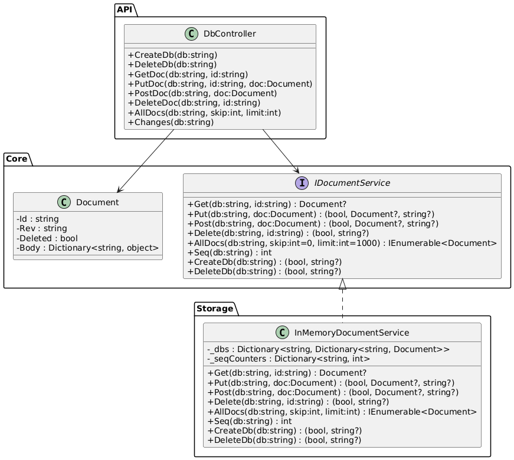

# PeaceDatabase

Документоориентированная база данных (аналог MongoDB), реализованная на C# (.NET 8). 
Проект строится по многоуровневой архитектуре, возможна расширяемость и заменяемость компонентов.

---

# Лабораторные

**1 лабораторная** - интерфейсы для БД. Интерфейсы для классов, таким образом мы задаем скелет нашей программы.

**2 лабораторная** - реализация интерфейсов. На этом этапе мы должны получить локально работающую бд.

**3 лабораторная** - разворачиваем бд на хосте. После этого этапа в нашу бд должна быть возможность ходить через grpc или rest (или другой rpc).

**4 и 5 лабораторная** - репликация и шардирование в любом порядке.

## Архитектура

### Core Layer

- **Document** — модель документа (Id, Rev, Deleted, Body).
- **IDocumentService** — интерфейс CRUD и управления БД.
- **IKvStore, IReplicationService, IIndexService, IAttachmentService** — абстракции для хранилища, репликации, индексов и вложений.
- Абстракции позволяют легко менять backend (например, память → диск → LSM).

### Storage Layer

- **InMemoryKvStore** — временное in-memory хранилище (используется для лабораторной работы 1).
- **InMemoryDocumentService** — реализация CRUD, AllDocs, Changes.
- **FileAttachmentStore** — хранение вложений вне основного KV-хранилища.
- **CompactionService** — фоновая очистка истории (будущее расширение).
- **SecondaryIndexService** — индексация для поиска по полям.

### API Layer

- **DbController** — базовые CRUD-операции, _all_docs, _changes.
- **AttachmentsController** — работа с вложениями (PUT/GET/DELETE).
- **ReplicationController** — интерфейс для репликации (push/pull).

### Admin / Monitoring

- **HealthController, Metrics** — эндпоинты для проверки состояния и сбора метрик.

### Cluster / Sharding (будущее)

- **ShardRouter, ClusterMembership, RebalanceService** — шардирование, маршрутизация и балансировка нагрузки.

---

## Потенциальные узкие места и решения

- **MVCC + ревизии** — фоновая компакция для очистки старых версий.
- **Attachments** — внешний FileAttachmentStore для масштабирования.
- **Skip в _all_docs** — замена на bookmark/seek для больших коллекций.
- **Write-heavy** — инкрементальные вторичные индексы.
- **Конфликты репликации** — IReplicationService с детерминированной стратегией разрешения.

---

## Текущая реализация

- **Core**: Document, IDocumentService.
- **Storage**: InMemoryDocumentService (in-memory CRUD, AllDocs, Changes).
- **API**: DbController (эндпоинты для CRUD и просмотра изменений).

---

## Диаграмма архитектуры (будущее)

---

## Запуск

1. `dotnet build`
2. `dotnet run`
3. API доступен по адресу: `http://localhost:5000/v1/db/{db}`

---

## Планы

- Дисковое и LSM-хранилище.
- Репликация и кластеризация.
- Индексация и поиск.

---