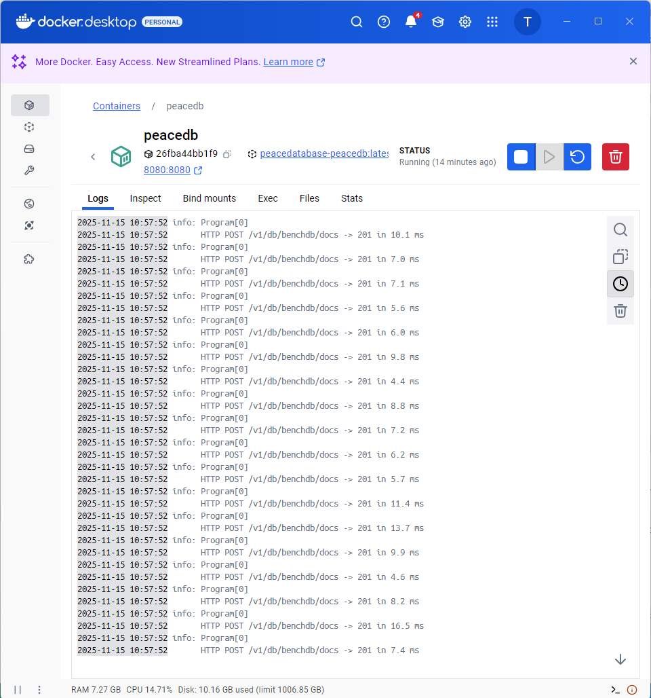
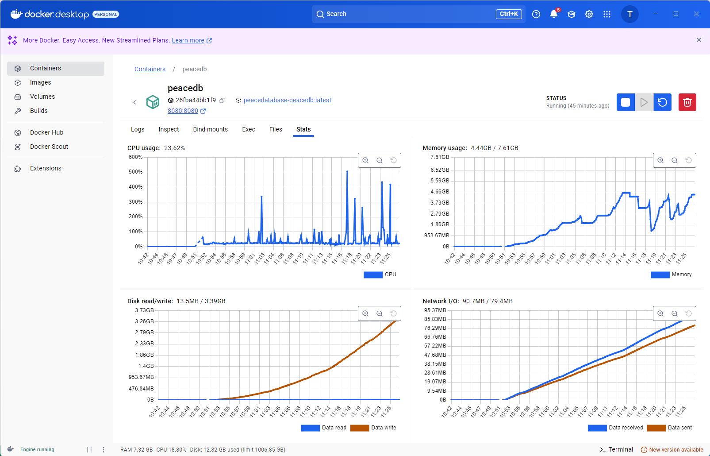
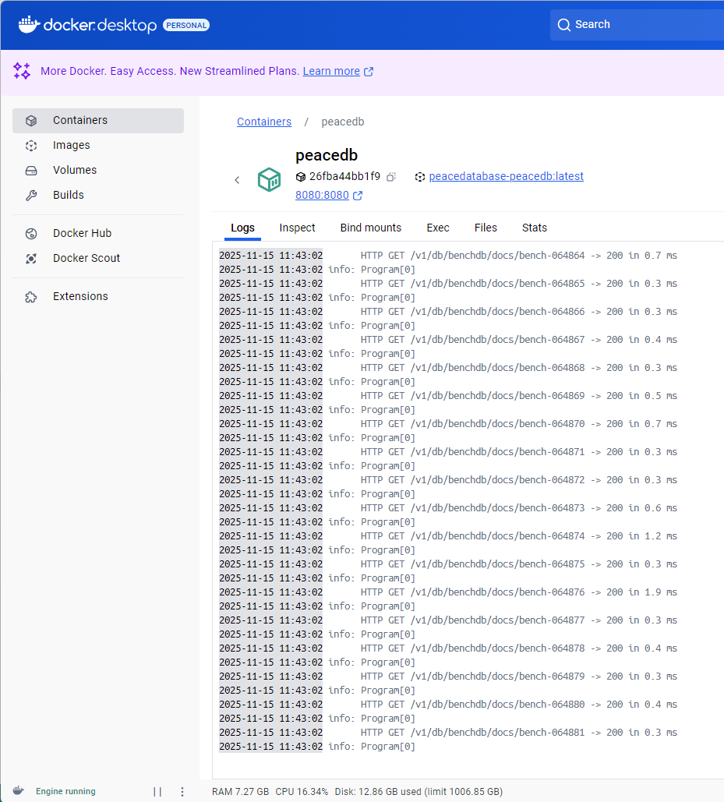

## PeaceDatabase: структура хранения данных на диске

Ниже рассматривается File‑режим (`Storage:Mode = "File"` / `STORAGE_MODE=File`).

### 1. Общая архитектура

- Логическая модель: документная БД (`IDocumentService`), реализованная в `InMemoryDocumentService`:
  - MVCC c ревизиями `_rev` (N‑hash);
  - индексы по полям (равенства, диапазоны), тегам и полнотексту;
  - операции `CreateDb/DeleteDb`, `Post/Put/Delete/Get`, `AllDocs`, `Find*`, `FullTextSearch`.
  - Дисковый слой: `FileDocumentService` оборачивает `InMemoryDocumentService` и добавляет:
  - WAL (write‑ahead log) — журналы операций в файле `wal.log` (JSONL);
  - снапшоты текущего состояния БД в `snapshot-*.jsonl` плюс `manifest.json`;
  - механизм восстановления «manifest → snapshot → WAL».

На уровне API и модели данных файловый режим совместим с in‑memory реализацией (оба реализуют `IDocumentService`), различается только способ долговременного хранения.

### 2. Организация каталогов и файлов (реализация)

Корень задаётся через `StorageOptions.DataRoot` (по умолчанию — `data`). Внутри — по одному каталогу на каждую БД:

- `DataRoot/`
  - `<db>/` — каталог конкретной базы (имя очищено от недопустимых символов).
    - `wal.log` — текущий журнал операций (WAL) в формате JSON Lines.
    - `manifest.json` — метаданные активного снапшота.
    - `snapshot-<unix_ts>.jsonl` — файл‑снапшот с полным списком документов.

Ключевые места реализации:

- `StorageOptions` — задаёт `DataRoot`, период снапшотов, размер WAL, уровень durability и имена файлов.
- `FileDocumentService.DbDir(...)` и `SanitizeName(...)` — отвечают за построение каталога БД и экранирование имени.
- `EnsureDbArtifacts(...)` — лениво создаёт каталоги и менеджеры `WalManager`/`SnapshotManager` для каждой БД.

Класс `StorageOptions` также задаёт:

- периодичность создания снапшота (`SnapshotEveryNOperations`);
- максимальный размер WAL (`SnapshotMaxWalSizeMb`), после которого тоже делается снапшот;
- уровень гарантии записи (`Durability`): `Relaxed`, `Commit`, `Strong`;
- флаги для включения/отключения снапшотов и имена файлов.

### 3. WAL: журнал операций (`WalManager` и `FileDocumentService`)

За WAL отвечает `WalManager`:

- файл `wal.log` — **append‑only JSONL**; каждая строка — одна операция:
  - `op`: `"put"` или `"del"`;
  - `id`: идентификатор документа;
  - `rev`: ревизия документа после операции;
  - `seq`: глобальный последовательный номер операции внутри БД;
  - `doc`: снимок документа (для `put`);
  - `ts`: временная метка.
- при каждой операции `Post/Put/Delete` `FileDocumentService`:
  1. выполняет действие во внутреннем `InMemoryDocumentService`;
  2. увеличивает счётчик `seq` для базы;
  3. добавляет запись в WAL через `WalManager.Append(...)`;
  4. при необходимости инициирует создание снапшота (`MaybeSnapshot`).
- уровень durability управляет тем, как часто делается `Flush`/`Flush(true)` (fsync).

Таким образом, WAL гарантирует, что после записи в журнал изменения не потеряются при падении процесса: при рестарте они будут доиграны поверх снапшота.
Чтобы он пригодился, нужно реализовать транзакции из нескольких операций на уровне API (пока не реализовано).

### 4. Снапшоты и manifest (`SnapshotManager`, `FileDocumentService.MaybeSnapshot`)

Снапшот описывается `SnapshotManager`:

- формат снапшота — JSON Lines:
  - каждая строка — сериализованный `Document` (включая системные поля `_id`, `_rev`, `Deleted`, `Data`, `Tags`, `Content`);
  - снапшот содержит актуальные «головы» всех документов на момент создания (включая помеченные как удалённые, если передано `includeDeleted: true`).
- файл `manifest.json` содержит:
  - `LastSeq` — номер последней операции, попавшей в снапшот;
  - `ActiveSnapshot` — имя файла текущего снапшота (`snapshot-*.jsonl`);
  - `SnapshotTimeUtc` — время создания.

`FileDocumentService` периодически вызывает `SnapshotManager.CreateSnapshot(...)`:

1. экспортирует все «головы» документов из памяти (`_inner.ExportAll(...)`);
2. записывает их построчно в `snapshot-<ts>.jsonl`;
3. обновляет `manifest.json` с новым `LastSeq` и именем снапшота;
4. ротирует WAL (`wal.Rotate()`), начиная пустой журнал.

Снапшоты резко сокращают время восстановления, так как позволяют не переигрывать длинный WAL с нуля.

### 5. Восстановление после падения (`RecoverAllDatabases`)

Конструктор `FileDocumentService` вызывает `RecoverAllDatabases()`:

1. **Инициализация БД и артефактов**:
   - для каждого подкаталога в `DataRoot` создаётся логическая БД во внутреннем `InMemoryDocumentService`;
   - инициализируются `WalManager` и `SnapshotManager` для этой БД.
2. **Чтение manifest**:
   - если `manifest.json` существует и корректен, `LastSeq` записывается в `_lastSeqByDb`;
   - в противном случае `LastSeq` считается равным 0.
3. **Загрузка снапшота**:
   - читаются строки активного снапшота;
   - каждая строка десериализуется в `Document` и импортируется в память через `_inner.Import(..., setAsHead:true, reindex:true, bumpSeq:false)`.
4. **Доигрывание WAL**:
   - WAL читается целиком (`ReadAllLines`);
   - каждый `WalRecord` десериализуется и применяется:
     - `put` → `_inner.Import(...);`
     - `del` → `_inner.Delete(...)` по указанной `rev` или по текущей голове;
   - `LastSeq` обновляется до максимального `rec.seq`.
5. **Синхронизация счётчика Seq**:
   - после восстановления `_inner.SetSeq(db, (int)LastSeq)` выравнивает внутренний `Seq` с номером последней операции в WAL/снапшоте.

В результате после рестарта процесс полностью восстанавливает состояние БД, не теряя подтверждённых операций.

### 6. Связь с логической моделью (`InMemoryDocumentService` и индексы)

Дисковый уровень **не меняет** модель данных:

- все операции и инварианты (оптимистическая блокировка по `_rev`, MVCC, индексы, полнотекст) реализованы в `InMemoryDocumentService`;
- `FileDocumentService` добавляет только:
  - долговременное хранение через WAL + снапшоты;
  - обработку recovery и консистентный глобальный `seq` на базе.

Таким образом:

- InMemory‑режим удобен для быстрых тестов/демо, но не переживает перезапуск процесса;
- File‑режим обеспечивает **durability на уровне файловой системы** без изменения контрактов API.

## Бенчмарк - сравнение с MongoDB и CouchDB

### PeaceDB (отдельный прогон N=100000)

Команда запуска:
```bash
python db_bench.py --n 100000 --out ../docs/db_bench.csv
```

N = 1000, PeaceDB vs MongoDB vs CouchDB:
```cmd
(venv) PS D:\_ITMOStudy\_Master\OPVP\PeaceDatabase\tools> python db_bench.py --n 1000 --out ../docs/db_bench.csv
Running benchmark for peacedb with N=1000...
peacedb: insert=21467.2 ms, read=14140.3 ms (insert/doc=21.4672 ms, read/doc=14.1403 ms)
Running benchmark for mongo with N=1000...
mongo: insert=123.9 ms, read=3070.0 ms (insert/doc=0.1239 ms, read/doc=3.0700 ms)
Running benchmark for couchdb with N=1000...
couchdb: insert=568.1 ms, read=15391.7 ms (insert/doc=0.5681 ms, read/doc=15.3917 ms)
Saved results to ../docs/db_bench.csv
```

N = 100000, PeaceDB:
```cmd
Running benchmark for peacedb with N=100000...

peacedb: insert=2073506.7 ms, read=1464877.1 ms (insert/doc=20.7351 ms, read/doc=14.6488 ms)
```







### Сводный бенчмарк (N=1000, db_bench.csv)

Файл `db_bench.csv` содержит результаты для трёх движков при N=1000 документов:

- **PeaceDB (File mode)**: `insert ≈ 21 467 ms`, `read ≈ 14 140 ms`
- **MongoDB**: `insert ≈ 124 ms`, `read ≈ 3 070 ms`
- **CouchDB**: `insert ≈ 568 ms`, `read ≈ 15 392 ms`

График:


- **Вставка**
  - **MongoDB** быстрее за счёт бинарного формата, оптимизированного движка хранения и bulk‑операции `insert_many` он вставляет 1000 документов за доли секунды.
  - **PeaceDB** медленнее: каждый документ отправляется отдельным HTTP‑запросом, для каждой операции пишется строка в JSONL‑WAL, при этом работают индексы и сериализация; это даёт порядка десятков миллисекунд на документ. TODO: сделать bulk операции по аналогии.
  - **CouchDB** по вставке находится между PeaceDB и MongoDB: один `_bulk_docs`‑запрос дешевле 1000 одиночных POST, но накладные расходы формата и внутреннего движка выше, чем у MongoDB.
- **Чтение**
  - **MongoDB** лидирует: чтение по первичному ключу опирается на B‑tree‑индекс и эффективный кэш.
  - **PeaceDB** читает из in‑memory структуры (`InMemoryDocumentService`) поверх дискового снапшота/WAL, но каждый вызов идёт через HTTP и JSON‑сериализацию, что даёт заметный оверхед на вызов.
  - **CouchDB** близка к нашей: HTTP+JSON, append‑only формат и индексация делают стоимость операций сопоставимой.

Итого:

- PeaceDB File‑режим обеспечивает простую и прозрачную структуру хранения (WAL + снапшоты) и корректное восстановление, но существенно проигрывает мощным движкам (MongoDB, CouchDB) по скорости массовых операций.
- MongoDB ожидаемо показывает лучшие результаты как по вставке, так и по чтению на единичном узле.
- CouchDB демонстрирует разумный компромисс, но при больших батчах (N=100000 одним `_bulk_docs`) требует тюнинга/разбиения батча, иначе возможны тайм‑ауты, что тоже отражает её ограничение «из коробки». 
