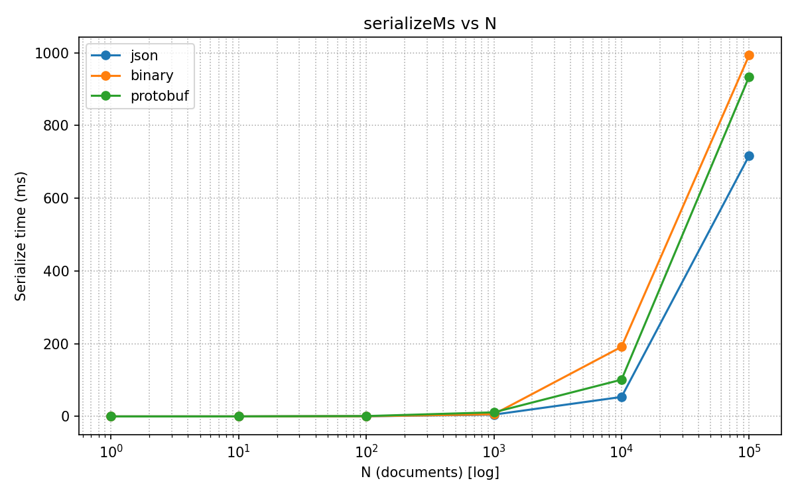
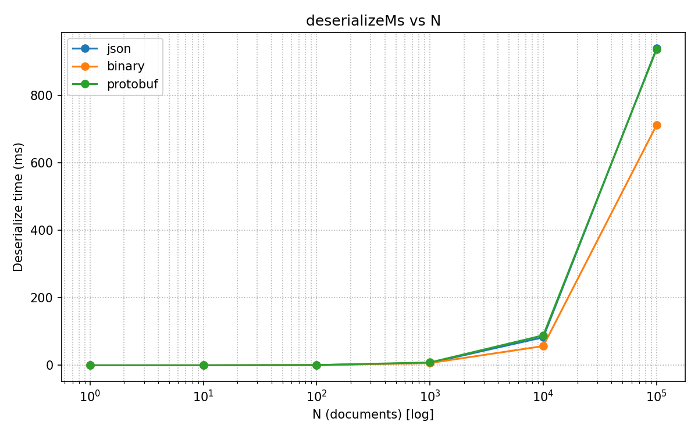
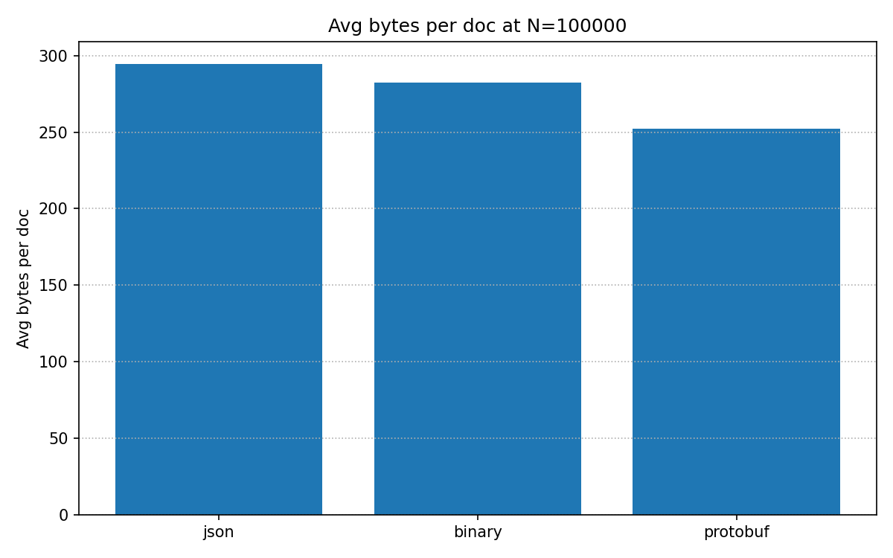

# SaDCA Lab 1 — Serialization Benchmarks (JSON vs Custom Binary vs Protobuf)

## Benchmark
- Endpoint: `POST /v1/bench/run` with dataset source (synthetic/file/url) and scales up to 100k.
- For each N in scales: serialize and deserialize all N documents for each format, measure total ms and bytes.
- Formats: json (System.Text.Json), binary (CustomBinaryDocumentCodec), protobuf (google.protobuf.Struct).

## Environment
- CPU/RAM/OS: please fill in (e.g., Windows 11, Ryzen 7, 32 GB RAM)
- .NET: 8.0; Python: 3.11; matplotlib 3.x

## Run
- Start API: `dotnet run`
- Run client: `python tools/bench_runner.py --source file --path-or-url <path-or-url> --max-docs 100000`
- Outputs under `docs/benchmarks/`
- 
## Results

