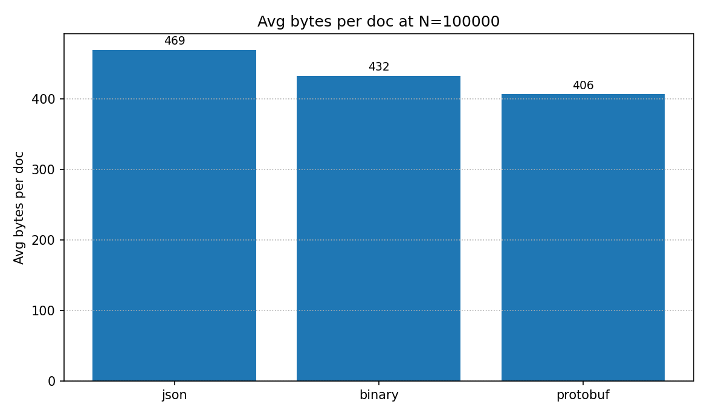
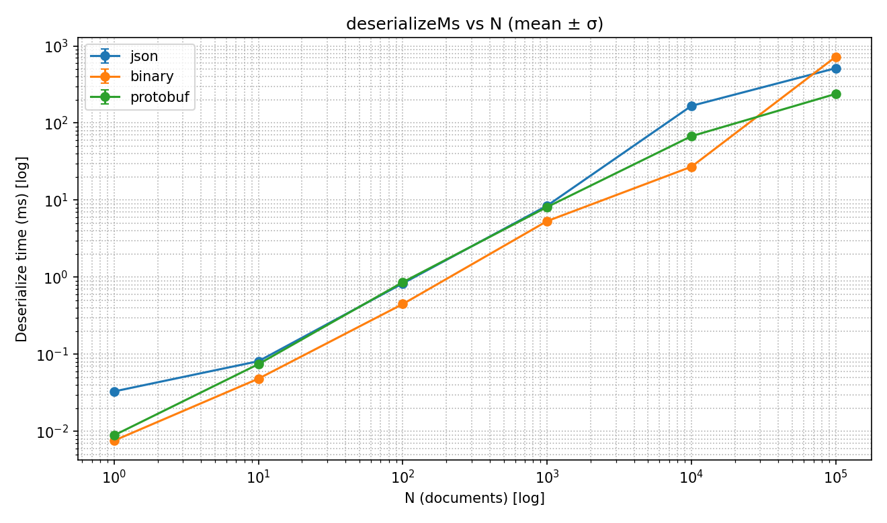

# SaDCA Lab 1 — Serialization Benchmarks (JSON vs Custom Binary vs Protobuf)

## Бенчмарк
- Endpoint: `POST /v1/bench/run` с указанием источника данных (synthetic/file/url) и масштабов вплоть до 100k документов.
- Для каждого N из списка scale: сериализация и десериализация всех N документов для каждого формата, измерение общего времени (мс) и размера (байты).
- Форматы: json (System.Text.Json), binary (CustomBinaryDocumentCodec), protobuf (google.protobuf.Struct).

## Окружение
- CPU/ОЗУ/ОС: заполните самостоятельно (например, Windows 11, Ryzen 7, 32 ГБ ОЗУ)
- .NET: 8.0; Python: 3.11; matplotlib 3.x

## Запуск
- Запуск API: `dotnet run`
- Запуск клиента: `python tools/bench_runner.py --source file --path-or-url <путь-или-url> --max-docs 100000`
- Все результаты в `docs/benchmarks/`
---

## Сравнение сериализации/десериализации документов в разных форматах (JSON, Binary, Protobuf)

### Цели

- Сравнить производительность и объем данных для разных форматов сериализации (JSON, собственный бинарный, protobuf) на реальных и синтетических датасетах PeaceDatabase.
- Оценить справедливость сравнения при работе со сложными вложенными структурами ("глубокие" JSON, как AMZN).

---

### Алгоритм и особенности сравнения

1. **Датасеты**  
   - Простые (`news`, `iris`): каждая строка — единичная, плоская запись (JSONL).
   - Сложные (`AMZN`): вложенный JSON, таблицы, метаданные, массивы и деревья - тяжело поддерживать, нужны преобразования.

2. **Реализация сериализации**
   - **JSON**: стандартная сериализация с помощью `System.Text.Json`, глубоко сериализует всю структуру.
   - **Бинарный** (CustomBinaryDocumentCodec): TLV-кодирование всех примитивов, рекурсивная поддержка вложенных словарей и списков.
   - **Protobuf**: используется поле google.protobuf.Struct для сериализации произвольных словарей/массивов.

3. **Проблемы**
   - Изначально бинарный и protobuf кодеки "теряли" сложные структуры или преобразовывали неизвестные типы в строку, что уменьшало размер (и смысл) сериализованных данных.
   - После исправлений бинарный формат рекурсивно сериализуют вложенные объекты, списки, массивы, числа и строки. Для Protobuf нужно продумывать proto-схемы преобразования.

### Что именно сравнивается
Для каждого n (число документов) сервер считает и возвращает:
serializeMs — суммарное время сериализации за iterations прогонов на n документах;
deserializeMs — суммарное время десериализации за iterations прогонов на тех же данных;

format ∈ {json,binary,protobuf}, n, totalBytes, avgBytesPerDoc.

Сравнение делаем на одинаковом n между форматами:
меньше serializeMs/deserializeMs → быстрее;
speedup(format) = serializeMs(JSON)/serializeMs(format) (и так же для deserializeMs).

Важно: измеряется суммарное время, а не «на документ». Для «честного» сравнения можно делить результат на n (и на iterations, если >1). 
Это не меняет порядка победителей, но делает цифры понятнее.
---

### Результаты

#### 1. Датасеты (`news`, `iris`)
- Размеры сериализованных объектов очень схожи между форматами, JSON немного больше из-за структурных кавычек и отступов.
- Время сериализации/десериализации примерно одинаково
- Protobuf чуть быстрее при больших объемах, чуть быстрее на сериализации/десериализации, но это может меняться в зависимости от объема и сложности данных.

---

### Выводы

- Для простых документов выбор формата практически не играет роли — важнее требования к межъязыковой совместимости и читаемости.
- Для сложных структур Protobuf предоставляет максимальную производительность и самый маленький итоговый размер без потери информации, но сложнее в отладке.
- Бинарный формат PeaceDatabase достаточно компактен и быстр, универсален для C#-экосистем.
- Важно использовать нормализацию типов (особенно для словарей и списков), чтобы не терять вложенные данные при сериализации, все форматы должны обрабатывать один и тот же объект, раскрывая его структуру полностью.
