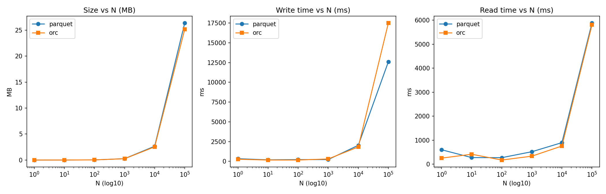

## SaDCA — Лабораторная 2. Spark DataSource V2 + Parquet/ORC

### Цель
Реализовать кастомный Source (DataSource V2) для Apache Spark на Java, читающий документы из PeaceDatabase по REST, построить простой ETL (read → transform → write) и сравнить эффективность хранения/чтения в Parquet и ORC.

Справочные материалы:
- Structured Streaming / Data Sources (Spark 3.5.x/4.x): [Structured Streaming Programming Guide](https://spark.apache.org/docs/latest/structured-streaming-programming-guide.html)
- Hadoop winutils для Windows: [cdarlint/winutils](https://github.com/cdarlint/winutils)
- [How to Install Apache Spark on Windows](https://phoenixnap.com/kb/install-spark-on-windows-10)

### Окружение
- ОС: Windows 11, JDK 11
- Spark: 3.5.7 (Hadoop 3)
- PeaceDatabase Web API: `http://localhost:5000`, БД: `news`

### Архитектура решения
- Кастомный коннектор (Java DataSource V2, batch read) → REST:
  - Эндпоинт пагинации: `GET /v1/db/{db}/_all_docs?skip=&limit=&includeDeleted=`
  - Схема набора:
    - `id` (string), `rev` (string), `deleted` (boolean)
    - `tags` (array<string>), `content` (string)
    - `data_json` (string) — сырой JSON поля `data` (для совместимости)
  - Планирование чтения: создаётся `InputPartition` на каждую страницу. При указании `maxRows` план основан на N (без доверия к `total` из API). Для случая без лимита выполняется «быстрый» пробег страниц до короткой/пустой.
- Джоб (Spark App) делает преобразование и запись в две колоночные цели:
  - Парсит `data_json` в столбцы: `link, headline, category, short_description, authors, date` (типизированные колонки улучшают компрессию/пушдаун)
  - Примерные признаки: `tags_count = size(tags)`, `content_len = length(content)`
  - Пишет в `out/parquet_#N` и `out/orc_#N`
  - Измеряет размер папок, время записи и чтения (`count()`) и сохраняет в CSV

### Spark DataSource / Job
- Модуль в каталоге `spark/` (JDK 11, Spark 3.5.x)
- Источник Spark V2 планирует чтение по `/v1/db/{db}/_stats` (без «пробега» страниц)
- Поддерживаются таймауты и ретраи HTTP

Полезные эндпоинты:
- `GET /v1/db/{db}/_all_docs?skip=&limit=&includeDeleted=` — постраничный вывод документов
- `GET /v1/db/{db}/_seq` — текущая последовательность изменений
- `GET /v1/db/{db}/_stats` — статистика БД (docsTotal/docsAlive/docsDeleted)

Ключевые файлы:
- `spark/peacedb-datasource/src/main/java/io/peacedb/spark/PeacedbDataSource.java`
- `spark/peacedb-datasource/src/main/java/io/peacedb/spark/read/*`
- `spark/peacedb-job/src/main/java/io/peacedb/job/PeacedbToColumnar.java`
- `tools/plot_peacedb_columnar.py`

### Опции коннектора
- `baseUrl` (по умолчанию `http://localhost:5000`)
- `db` (по умолчанию `news`)
- `outDir` - папка с результатами
- `pageSize` (по умолчанию `100`)
- `includeDeleted` (по умолчанию `false`)
- `maxRows` — ограничение количества возвращаемых строк на стороне источника (используется в бенчмарке)
- `connectTimeoutMs` / `readTimeoutMs` — таймауты HTTP
- `retries`, `retryBackoffMs` - перезапуски

### Сборка и запуск
Установить Java, Spark, winutils

Задать переменные окружения JAVA_HOME, HADOOP_HOME, SPARK_HOME

```bash
cd spark
mvn -q -DskipTests package

# Пример запуска (N=1/10/100/1000/10000/100000, warm‑up в одном прогоне)
spark-submit --class io.peacedb.job.PeacedbToColumnar --master local[*] peacedb-job/target/peacedb-job-*.jar --baseUrl http://localhost:5000 --db news --outDir ./out --pageSize 200 --connectTimeoutMs 10000 --readTimeoutMs 60000 --retries 3 --retryBackoffMs 500

# Построение графиков
python tools/plot_peacedb_columnar.py spark/out/metrics.csv --out spark/out/plot.png
```

Примечание для Windows: при ошибке `NativeIO$Windows.access0` установить `winutils.exe` с dll для Hadoop 3.3.x и задать `HADOOP_HOME`/`PATH` (см. winutils выше). Для локальной ФС в коде/submit включены безопасные настройки (pure‑Java путь).


### Методика измерений
- Для каждого N в `[1, 10, 100, 1000, 10000, 100000]` читаем `maxRows=N`, считаем признаки, парсим `data_json` в колонки и:
  1) Выполняем тёплый прогон (кэш + микро‑запись/чтение) для прогрева JIT/кодеков/коммит‑протокола
  2) Измеряем запись и считывание Parquet и ORC (миллисекунды)
- Результаты накапливаются в `out/metrics.csv` c колонками: `n,format,bytes,write_ms,read_ms,rows`

### Результаты (пример, с тёплого прогона)



[Таблица (CSV)](tools/docs/SaDCA-lab2-spark-orc-parquet/metrics.csv)

Наблюдения:
- Размеры у Parquet и ORC близки (после парсинга `data_json` в колонки). ORC слегка компактнее на этих данных.
- Время записи: у Parquet и ORC соизмеримо на N до 10^4, на 10^5 ORC медленнее; начальные точки (1) могут отличаться из‑за недостаточного прогрева (cold start).
- Время чтения: ORC немного быстрее, Parquet догоняет.

Графики: `spark/out/plot.png` (лог‑ось X).

### Решенные проблемы
- Не хранить вложенные поля как «сырой JSON» — парсить в типизированные колонки (даёт компрессию и pushdown/column pruning).
- Разогревать пайплайн перед замерами (JIT/кодеки/коммиттер), иначе первый пункт искажен.
- На Windows учесть нюансы Hadoop Native/`winutils`.

### Ограничения и улучшения
- Сейчас данные можно загружать только "пакетами" (batch-only). В будущем можно добавить режим микробатчей или потоковой обработки (stream), используя поле `_seq` и watermark.
- На данный момент фильтрация поддерживается только на стороне Spark. Можно улучшить, чтобы фильтры Spark автоматически переводились в запросы к API (`/v1/db/{db}/_find/*`), чтобы уменьшить объем передаваемых данных.
- Структура данных (`data`) может меняться со временем. Чтобы не "ломать" обработку при изменении формата, стоит использовать функции вроде `from_json` с гибкой (нежесткой) схемой и автоматическим определением структуры (`schema_of_json` или автоинференс).

### Выводы
- Колоночные форматы выигрывают при типизации полей. Для новостного датасета состоящего преимущественно из текста, а не чисел ORC незначительно компактнее, времена записи/чтения для Parquet и ORC близки.


